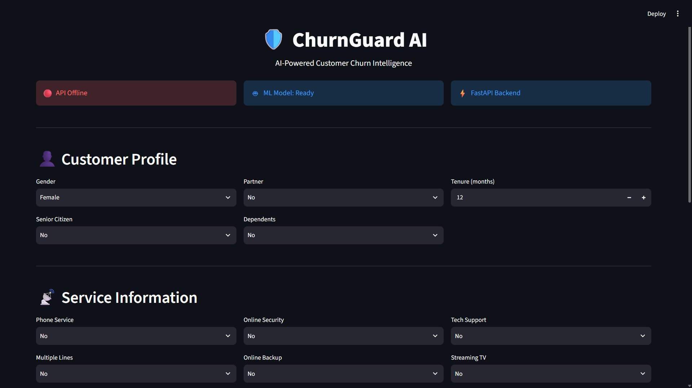
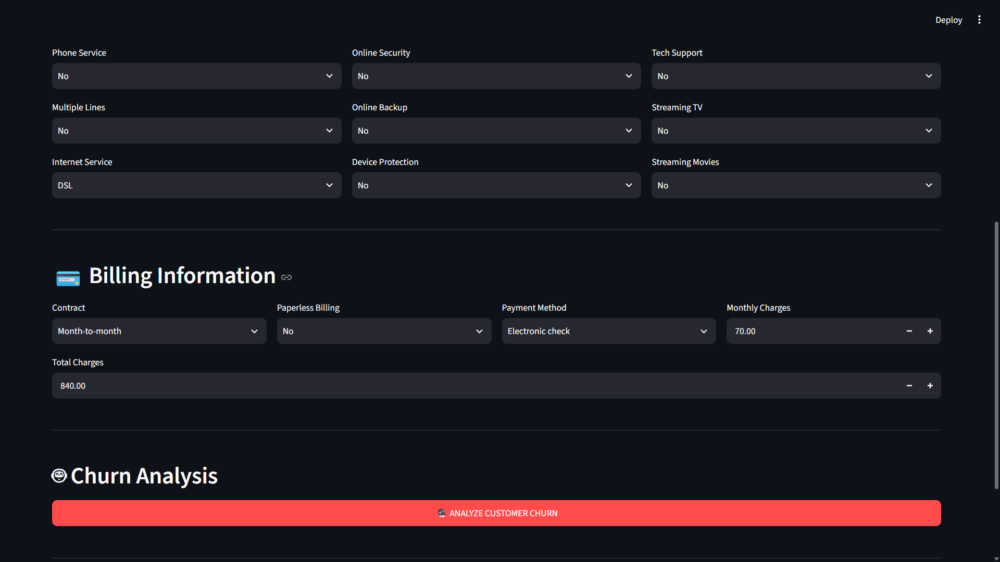
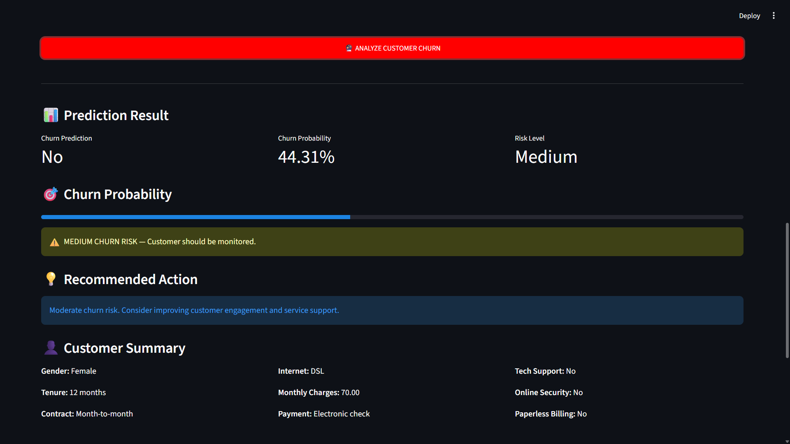
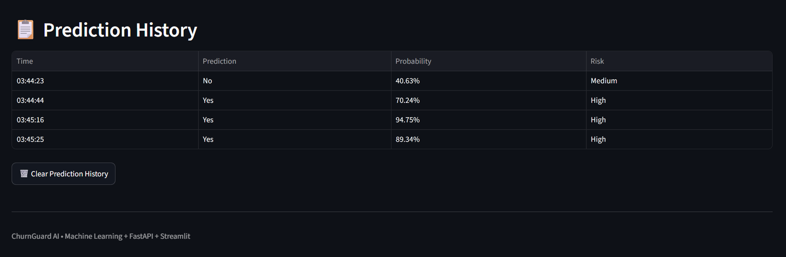
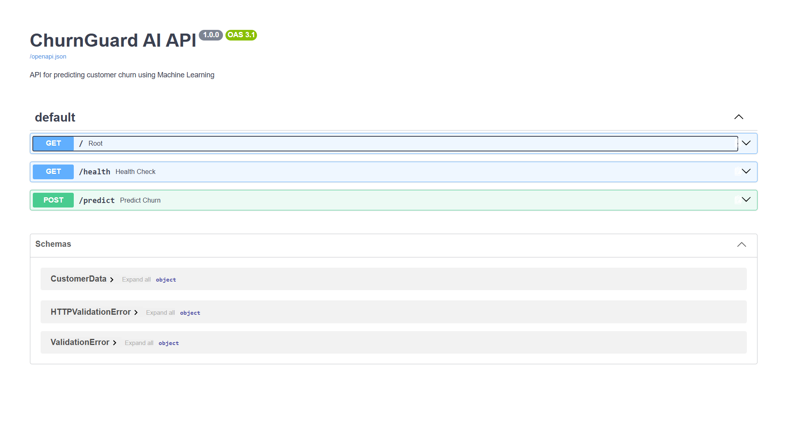

# 🛡️ ChurnGuard AI

## AI-Powered Customer Churn Prediction System

ChurnGuard AI is a Machine Learning-based customer churn prediction system designed to identify customers who are likely to leave a service.

The system uses customer information and a trained Machine Learning model to predict churn probability, classify customers into different risk levels, and provide recommended retention actions.

The project combines **Machine Learning, FastAPI, and Streamlit** to provide both an API-based backend and an interactive web interface.

---

## 🎯 Problem Statement

Customer churn is a major challenge for businesses because losing existing customers can negatively affect revenue and long-term growth.

Traditional methods may identify customer loss only after it happens. ChurnGuard AI uses Machine Learning to predict customers who may leave in advance.

This allows businesses to identify high-risk customers and take suitable retention actions before they churn.

---

## ✨ Key Features

- 🤖 Machine Learning-based churn prediction
- 📈 Churn probability score
- 🚦 Customer risk classification:
  - Low Risk
  - Medium Risk
  - High Risk
- 💡 Recommended customer retention actions
- ⚡ FastAPI backend
- 📖 Interactive Swagger API documentation
- 🌐 Streamlit web interface
- 📊 Prediction history
- 🗃️ IBM Telco Customer Churn dataset
- 💾 Saved trained Machine Learning model
- 🔄 API and web application integration

---

## 🧠 Machine Learning

ChurnGuard AI uses the **IBM Telco Customer Churn dataset** for training and prediction.

The dataset contains information related to:

- Customer demographics
- Account information
- Contract type
- Internet services
- Payment methods
- Monthly charges
- Total charges
- Customer tenure
- Churn status

The trained model is stored in:

```text
models/churn_model.pkl
```

Model evaluation results are stored in:

```text
models/model_results.json
```

## 📊 Risk Classification

The system converts the predicted churn probability into three risk levels:

| Risk Level | Meaning |
|---|---|
| 🟢 Low Risk | Customer has a relatively low probability of churn. |
| 🟡 Medium Risk | Customer shows a moderate probability of churn. |
| 🔴 High Risk | Customer has a high probability of leaving. |

This makes the prediction easier for businesses to understand and helps them take appropriate retention actions.

## 💡 Retention Recommendations

Based on the customer's predicted risk level, ChurnGuard AI can recommend suitable actions such as:

Offering personalized discounts
Providing special plans or offers
Improving customer support
Contacting high-risk customers
Providing loyalty benefits
Reviewing service or contract options

The objective is to help businesses take proactive action instead of reacting after a customer leaves.

🏗️ System Architecture
                 Customer Information
                         │
                         ▼
                ┌─────────────────┐
                │ Streamlit Web UI│
                └────────┬────────┘
                         │
                         ▼
                  ┌──────────────┐
                  │   FastAPI    │
                  │   Backend    │
                  └──────┬───────┘
                         │
                         ▼
                ┌─────────────────┐
                │ Trained ML Model│
                │ churn_model.pkl │
                └────────┬────────┘
                         │
                         ▼
              Churn Probability Score
                         │
                         ▼
                 Risk Classification
                         │
                         ▼
              Retention Recommendation

## 📸 Application Screenshots

### 🌐 Streamlit Web Application

ChurnGuard AI provides an interactive Streamlit interface for entering customer information and analyzing churn risk.

#### Dashboard & Customer Profile



#### Service Information



#### Billing Information



#### Prediction Result

The system displays the predicted churn status, churn probability, risk level, recommended action, and customer summary.



### 🔌 FastAPI Swagger API

The backend provides interactive API documentation through Swagger UI, allowing users to test the churn prediction API.




🛠️ Technologies Used
Technology	Purpose
Python	Core programming language
Pandas	Data processing
NumPy	Numerical operations
Scikit-learn	Machine Learning
Joblib	Model serialization
FastAPI	Backend REST API
Uvicorn	API server
Streamlit	Interactive web interface
JSON	Model results and data exchange
Git & GitHub	Version control
📂 Project Structure
ChurnGuard-AI/
│
├── backend/
│   └── main.py
│
├── data/
│   └── Telco-Customer-Churn.csv
│
├── frontend/
│   ├── app.py
│   └── app_backup.py
│
├── ml/
│   ├── inspect_data.py
│   └── train_model.py
│
├── models/
│   ├── churn_model.pkl
│   └── model_results.json
│
├── .gitignore
├── README.md
└── requirements.txt
⚙️ Installation
1. Clone the repository
git clone https://github.com/Asmitttts/TDDS015B.git
2. Open the project folder
cd TDDS015B
3. Create a virtual environment
python -m venv venv
4. Activate the virtual environment
Windows PowerShell
venv\Scripts\Activate.ps1
5. Install dependencies
pip install -r requirements.txt
▶️ Running the Application
Start the FastAPI Backend

From the project root:

uvicorn backend.main:app --reload

The API will run locally on:

http://127.0.0.1:8000
📖 FastAPI Swagger Documentation

After starting the backend, open:

http://127.0.0.1:8000/docs

Swagger provides an interactive interface for testing the ChurnGuard AI API.

You can enter customer information and send prediction requests directly through the browser.

🌐 Start the Streamlit Frontend

Open another terminal and activate the virtual environment.

Then run:

streamlit run frontend/app.py

The Streamlit application will open in your browser.

The interface allows users to enter customer information and receive:

Churn prediction
Churn probability
Risk level
Recommended retention action
Prediction history
📊 Dataset

The project uses the IBM Telco Customer Churn dataset.

The dataset contains 7,043 customer records and information about customer demographics, services, contracts, billing, and churn.

The target variable is:

Churn

where the customer is classified as either:

Yes

or

No
🔬 Machine Learning Workflow

The Machine Learning workflow follows these major steps:

Dataset
   ↓
Data Inspection
   ↓
Data Preprocessing
   ↓
Feature Preparation
   ↓
Model Training
   ↓
Model Evaluation
   ↓
Model Saving
   ↓
Churn Prediction

The training process is implemented in:

ml/train_model.py

Data inspection is performed using:

ml/inspect_data.py
📈 Model Results

The trained model evaluation results are stored in:

models/model_results.json

The saved model is available at:

models/churn_model.pkl

These files allow the trained model and its evaluation results to be reused without retraining every time the application starts.

🔌 API Integration

The FastAPI backend provides an API endpoint for customer churn prediction.

The general workflow is:

Client
  ↓
FastAPI API
  ↓
Input Processing
  ↓
Machine Learning Model
  ↓
Prediction
  ↓
Probability + Risk Level
  ↓
Retention Recommendation

This API architecture allows the Machine Learning model to be integrated with other applications in the future.

🔮 Future Scope

ChurnGuard AI can be further improved by:

Using advanced Machine Learning algorithms
Adding model explainability using SHAP or similar techniques
Adding customer segmentation
Integrating real-time business databases
Adding automated email/SMS retention campaigns
Building dashboards for business analytics
Deploying the application on cloud platforms
Adding continuous model retraining
Monitoring model performance over time
🎓 Academic Purpose

This project demonstrates the practical application of:

Machine Learning
Data preprocessing
Predictive analytics
REST API development
Web application development
Model deployment
Software integration
Version control using Git and GitHub

It demonstrates how a Machine Learning model can be transformed into a usable application rather than remaining only as a training script.

👨‍💻 Author

Asmitttts

ChurnGuard AI — AI-Powered Customer Churn Prediction System

📌 Project Status

Status: Completed ✅

Technologies: Python | Machine Learning | FastAPI | Streamlit

Repository: Public GitHub Repository